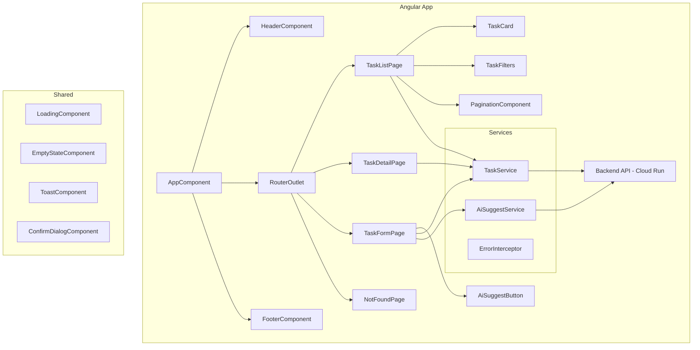

# Frontend Angular — Design

**Spec**: `.specs/features/frontend-angular/spec.md`
**Status**: Draft

---

## Architecture Overview

Aplicação Angular 17+ standalone consumindo API REST do todoApp. Single-page application com lazy loading de features, Signals para estado reativo, e componentes standalone.



### Data Flow

```
User Action → Component → Service (Signal) → HTTP → API → Response → Service updates Signals → Component re-renders
```

### Component File Structure (OBRIGATÓRIO)

Cada componente DEVE ter exatamente 3 arquivos separados:

```
nome.component.ts      — Lógica + decorator (@Component)
nome.component.html    — Template (referenciado via templateUrl)
nome.component.scss    — Estilos (referenciado via styleUrl)
```

**NUNCA** usar `template:` ou `styles:` inline. Todo template e estilo deve estar em arquivo separado, seguindo o padrão do psico-landing-page.

---

## Code Reuse Analysis

### Patterns from psico-landing-page

| Pattern | Project Location | How to Apply |
|---------|-----------------|-------------|
| Standalone Components | Todo o app | `@Component({ standalone: true, imports: [...] })` |
| Signals + inject() | `dashboard.component.ts` | `taskList = signal<Task[]>([]); private service = inject(TaskService)` |
| `takeUntilDestroyed` | `dashboard.component.ts` | Gerenciamento automático de subscriptions |
| SCSS variables + CSS custom properties | `styles.scss`, `dashboard.component.scss` | Sistema de design com variáveis |
| Feature structure | `features/admin/pages/` | `features/tasks/pages/` + `features/tasks/components/` |
| Empty/Loading/Error states | `dashboard.component.html` | Padrão `@if (loading) / @if (error) / @if (empty)` |
| Lazy routes | `admin.routes.ts` | `loadChildren: () => import(...)` com chunk name |

### New Code Needed

| Component | Reason |
|-----------|--------|
| `TaskService` | Comunicação com API REST de tasks |
| `AiSuggestService` | Integração com endpoint de IA |
| `TaskCard` | Card de tarefa reutilizável na lista |
| `TaskFilters` | Filtros de status/priority |
| `ConfirmDialog` | Modal de confirmação antes de deletar |
| `Toast` | Notificações toast de sucesso/erro |

---

## Components

### Core Components

#### HeaderComponent
- **Purpose**: Barra de navegação superior com logo, navegação e ações
- **Location**: `src/app/shared/components/header/`
- **Dependencies**: RouterModule
- **Reuses**: Pattern from psico header

#### AppComponent
- **Purpose**: Root component com header + router-outlet + footer
- **Location**: `src/app/app.component.ts`
- **Dependencies**: RouterModule, HeaderComponent, FooterComponent

### Feature: Tasks

#### TaskListPage
- **Purpose**: Página principal com lista paginada de tarefas e filtros
- **Location**: `src/app/features/tasks/pages/task-list/`
- **Interfaces**:
  - State signals: `tasks`, `loading`, `error`, `empty`, `page`, `filters`
- **Dependencies**: TaskService, TaskCardComponent, TaskFiltersComponent, PaginationComponent, LoadingComponent, EmptyStateComponent

#### TaskDetailPage
- **Purpose**: Página de detalhes de uma tarefa específica
- **Location**: `src/app/features/tasks/pages/task-detail/`
- **Dependencies**: TaskService, LoadingComponent, ConfirmDialogComponent

#### TaskFormPage
- **Purpose**: Formulário de criação/edição de tarefa com sugestão de IA
- **Location**: `src/app/features/tasks/pages/task-form/`
- **Interfaces**:
  - Recebe `id` opcional via route param (null = create, value = edit)
- **Dependencies**: TaskService, AiSuggestService, ReactiveFormsModule, AiSuggestButtonComponent

#### TaskCardComponent
- **Purpose**: Card individual de tarefa na lista
- **Location**: `src/app/features/tasks/components/task-card/`
- **Inputs**: `task: Task`
- **Outputs**: `view: Task`, `edit: Task`, `delete: Task`

#### TaskFiltersComponent
- **Purpose**: Filtros de status e prioridade
- **Location**: `src/app/features/tasks/components/task-filters/`
- **Outputs**: `filterChange: { status?: string; priority?: string }`

#### PaginationComponent
- **Purpose**: Navegação entre páginas
- **Location**: `src/app/features/tasks/components/pagination/`
- **Inputs**: `page: number`, `totalPages: number`
- **Outputs**: `pageChange: number`

### Shared Components

#### LoadingComponent
- **Purpose**: Skeleton/spinner de carregamento
- **Location**: `src/app/shared/components/loading/`

#### EmptyStateComponent
- **Purpose**: Mensagem quando não há dados
- **Location**: `src/app/shared/components/empty-state/`
- **Inputs**: `message: string`, `icon?: string`

#### ConfirmDialogComponent
- **Purpose**: Modal de confirmação para ações destrutivas
- **Location**: `src/app/shared/components/confirm-dialog/`

#### ToastComponent
- **Purpose**: Notificações toast de sucesso/erro/info
- **Location**: `src/app/shared/components/toast/`

### Services

#### TaskService
- **Location**: `src/app/core/services/task.service.ts`
- **Methods**:
  - `getTasks(params: TaskListParams): Observable<Page<Task>>`
  - `getTask(id: number): Observable<Task>`
  - `createTask(data: CreateTaskRequest): Observable<Task>`
  - `updateTask(id: number, data: UpdateTaskRequest): Observable<Task>`
  - `deleteTask(id: number): Observable<void>`

#### AiSuggestService
- **Location**: `src/app/core/services/ai-suggest.service.ts`
- **Methods**:
  - `suggest(title: string, description?: string): Observable<AiSuggestion>`

#### ErrorInterceptor
- **Location**: `src/app/core/interceptors/error.interceptor.ts`
- **Purpose**: Intercepta erros HTTP, logging, exibe toast de erro global

---

## Data Models

### Task

```typescript
export interface Task {
  id: number;
  title: string;
  description: string;
  priority: 'LOW' | 'MEDIUM' | 'HIGH';
  status: 'TODO' | 'IN_PROGRESS' | 'DONE';
  createdAt: string;  // ISO datetime
  updatedAt: string;  // ISO datetime
}

export interface CreateTaskRequest {
  title: string;
  description?: string;
  priority?: 'LOW' | 'MEDIUM' | 'HIGH';
}

export interface UpdateTaskRequest {
  title?: string;
  description?: string;
  priority?: 'LOW' | 'MEDIUM' | 'HIGH';
  status?: 'TODO' | 'IN_PROGRESS' | 'DONE';
}

export interface TaskListParams {
  page?: number;
  size?: number;
  status?: string;
  priority?: string;
  sort?: string;
}
```

### AiSuggestion

```typescript
export interface AiSuggestRequest {
  title: string;
  description?: string;
}

export interface AiSuggestion {
  suggestedPriority: 'LOW' | 'MEDIUM' | 'HIGH';
  refinedDescription: string;
  suggestedSubtasks: string[];
}
```

### Page Response (Spring Page)

```typescript
export interface Page<T> {
  content: T[];
  totalPages: number;
  totalElements: number;
  size: number;
  number: number;  // current page (0-indexed)
  first: boolean;
  last: boolean;
  empty: boolean;
}
```

---

## Routing

```typescript
export const routes: Routes = [
  {
    path: '',
    /* webpackChunkName: "tasks" */
    loadChildren: () => import('./features/tasks/tasks.routes').then(m => m.TASK_ROUTES)
  },
  {
    path: '**',
    component: NotFoundComponent
  }
];

// tasks.routes.ts
export const TASK_ROUTES: Routes = [
  { path: '', component: TaskListPage },
  { path: 'new', component: TaskFormPage },
  { path: ':id', component: TaskDetailPage },
  { path: ':id/edit', component: TaskFormPage }
];
```

---

## Error Handling Strategy

| Scenario | Handling | User Impact |
|----------|----------|-------------|
| API 4xx | ErrorInterceptor → Toast | Toast com mensagem do backend |
| API 5xx | ErrorInterceptor → Toast | "Serviço temporariamente indisponível" |
| Network Error (0) | ErrorInterceptor → Toast | "Verifique sua conexão" |
| Task not found (404) | Component check | Página "Tarefa não encontrada" |
| Empty list | Component check | Empty state "Nenhuma tarefa encontrada" |
| Form validation | Reactive Forms validators | Mensagem inline no campo |
| AI timeout | Service catchError + fallback | Toast "IA temporariamente indisponível" |

---

## Tech Decisions

| Decision | Choice | Rationale |
|----------|--------|-----------|
| State Management | Angular Signals | Nativo, simples o suficiente para CRUD |
| HTTP Client | Angular HttpClient | Nativo, intercptable |
| Forms | ReactiveFormsModule | Validação robusta, tipada |
| Styling | SCSS + CSS Custom Properties | Performance, sem runtime extra |
| Testing | Jest (via @angular-builders/jest) | Mesmo setup do psico-landing-page |
| Linting | ESLint + Angular ESLint | Mesmo setup do psico-landing-page |
| Path aliases | `@/` → `src/app/` | Imports limpos |
| Toast | Manual (lightweight) | Evita dependência extra |
| Commit | commitlint + husky | Mesmo padrão conventional commits |
