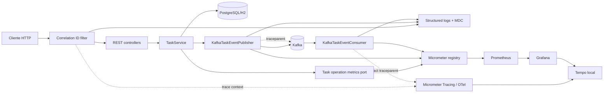

# Observability Foundation — Design

**Spec:** `.specs/features/observability-foundation/spec.md`
**Context:** `.specs/features/observability-foundation/context.md`
**Status:** Approved — task breakdown created

## Architecture Overview

A observabilidade será adicionada como infraestrutura transversal. O domínio `Task` não
conhecerá Prometheus, Micrometer, OpenTelemetry ou Grafana. A aplicação expõe sinais
operacionais e usa portas somente onde elas evitam acoplamento direto em casos de uso.



### Signal ownership

| Signal | Primary mechanism | Purpose |
| --- | --- | --- |
| Health | Spring Boot Actuator | Liveness/readiness and safe deployment probes |
| Technical metrics | Actuator, Micrometer binders and Spring Kafka observation | HTTP, JVM, HikariCP and Kafka health/performance |
| Business metrics | Micrometer adapter behind an application port | Task and AI events without coupling use cases to Micrometer |
| Logs | SLF4J/Logback MDC plus Spring Boot structured JSON | Human-readable investigation and functional correlation |
| Traces | Micrometer Tracing bridge to OpenTelemetry + OTLP exporter | Latency/causality across HTTP, JDBC and Kafka |

## Research Decisions

### Libraries and compatibility

The proposed dependency set uses Spring Boot-managed versions:

| Capability | Proposed dependency | Reason |
| --- | --- | --- |
| Actuator and base Micrometer | `spring-boot-starter-actuator` | Health groups, common JVM/HTTP/Hikari metrics and endpoint management |
| Prometheus scrape format | `micrometer-registry-prometheus` | Adds `/actuator/prometheus` when explicitly exposed |
| Distributed tracing | `micrometer-tracing-bridge-otel` | Uses Spring Boot's Micrometer-first observability model |
| OTLP trace export | `opentelemetry-exporter-otlp` | Exports traces to a configurable OTLP endpoint |

Spring Boot 3.5 documents OpenTelemetry support through Micrometer and the OTLP
exporter. Spring Kafka supports Micrometer observations for `KafkaTemplate` and listener
containers, including low-cardinality messaging attributes. The implementation must use
the Spring Boot dependency management and must not assign ad-hoc versions. [Spring Boot
observability](https://docs.spring.io/spring-boot/3.5/reference/actuator/observability.html),
[Spring Kafka monitoring](https://docs.spring.io/spring-kafka/reference/kafka/micrometer.html)

The OpenTelemetry Spring Boot starter is intentionally not selected for M1. It overlaps
with the Spring Boot/Micrometer integration and adds a second auto-configuration model.
It remains an alternative to revisit only if a later requirement cannot be met by the
chosen bridge.

### Tempo versus Jaeger

| Criterion | Tempo monolithic | Jaeger all-in-one |
| --- | --- | --- |
| Local topology | Tempo backend plus Grafana UI | Collector, query service and UI in one container |
| Learning value here | Correlates traces with Prometheus dashboards in the chosen Grafana workflow | Fastest way to learn trace search in isolation |
| Persistence | Local filesystem volume for development/test | Default memory storage loses traces on restart; persistent backend requires configuration |
| Runtime shape | One process shares ingest, query and storage resources | One container, but its UI is separate from Grafana |
| Production direction | Object storage and distributed mode are available later, but are out of scope now | Storage topology also must be designed separately for production |

**Choice:** Grafana Tempo in monolithic mode, backed by a local volume, with Grafana as
the only visualization UI. Tempo documents monolithic mode as appropriate for getting
started and development, while object storage is the production-oriented path. Jaeger
all-in-one is simpler, but defaults to volatile memory storage. [Tempo deployment
modes](https://grafana.com/docs/tempo/latest/reference-tempo-architecture/deployment-modes/),
[Jaeger deployment](https://www.jaegertracing.io/docs/1.76/deployment/)

No fixed CPU or memory limit is assumed: both backends vary with trace rate, retention
and query load. The implementation validation will record image versions, exposed ports,
volume growth and observed resource use with a controlled traffic profile before any
resource limit is proposed.

## Runtime and Configuration Design

### Profiles and feature flags

Configuration remains external to code and follows existing Spring profiles:

| Environment | Structured logs | Prometheus endpoint | OTLP export | Tempo/Grafana |
| --- | --- | --- | --- | --- |
| Default H2 | Human-readable by default; JSON opt-in for a lab scenario | Enabled only when observability profile is active | Disabled unless explicitly enabled | Local only |
| `postgres` local | Same as default | Enabled through local observability profile | OTLP points to local Tempo when enabled | Local only |
| `production` | JSON console logs | Explicitly expose health, info and Prometheus only | Configurable, disabled by default | Not deployed |

The exact property names will be validated against Spring Boot 3.5 during implementation.
The design requires these semantic controls:

- `observability.tracing.enabled`: disables tracing/export without affecting correlation ID.
- `management.otlp.tracing.endpoint` and related OTLP settings: supplied only through
  environment variables when tracing is intentionally enabled.
- management web exposure allowlist: `health`, `info`, `prometheus` in production.
- `logging.structured.format.console=logstash` (or equivalent approved JSON format) only
  in the selected profile. Spring Boot's Logstash JSON includes MDC key-values, allowing
  `correlationId` to appear in logs without a custom JSON encoder. [Spring Boot structured
  logging](https://docs.spring.io/spring-boot/reference/features/logging.html)

### Health groups

| Endpoint | Includes | Excludes | Reason |
| --- | --- | --- | --- |
| `/actuator/health/liveness` | Application liveness state | DB and Kafka dependencies | A dependency outage must not trigger a restart storm |
| `/actuator/health/readiness` | Readiness state and database health | Kafka health initially | CRUD requests synchronously require the database; Kafka health is monitored but must not flap traffic until delivery semantics are redesigned |
| `/actuator/health` | Aggregated, sanitized summary | Detailed component data by default | Safe public health response |

This uses Spring Boot health groups, which expose dedicated liveness/readiness paths. Cloud
Run can use HTTP startup, liveness and readiness probes later, but configuring those probes
changes a Cloud Run revision and is deliberately out of M1 implementation scope. [Spring
Boot probes](https://docs.spring.io/spring-boot/reference/actuator/endpoints.html), [Cloud
Run health checks](https://cloud.google.com/run/docs/configuring/healthchecks)

### Local observability topology

The local stack will use an additive Compose file, not the production Dockerfile or
Cloud Run workflow:

```text
docker-compose.yml + docker-compose.observability.yml

app ──scrape target──> Prometheus ──query──> Grafana
app ──OTLP traces───> Tempo ───────────────> Grafana
```

Planned local-only artifacts:

| Artifact | Responsibility | Persistent volume |
| --- | --- | --- |
| `docker-compose.observability.yml` | Adds Prometheus, Grafana and Tempo to the existing local network | Named volumes declared there |
| `observability/prometheus/prometheus.yml` | Scrapes the application Prometheus endpoint | Prometheus TSDB volume |
| `observability/tempo/tempo.yml` | Monolithic Tempo receiver, local storage and retention | Tempo trace-data volume |
| `observability/grafana/provisioning/` | Datasources, dashboard discovery and dashboard JSON | Grafana data volume |

Proposed host ports, subject to collision validation before implementation: Grafana `3000`,
Prometheus `9090`, Tempo query API `3200`, OTLP gRPC `4317`, and OTLP HTTP `4318`.
Only Grafana and Prometheus need host access for the first lab; Tempo's OTLP receiver can
remain reachable only from the Compose network if the application also runs in Compose.

## Component Design

### Correlation ID HTTP filter

- **Location:** `src/main/java/com/banzak/todoapp/interfaces/rest/observability/CorrelationIdFilter.java`
- **Purpose:** accept or create a UUID-like `X-Correlation-ID`, put it in MDC for the
  request lifetime and return it in the response header.
- **Validation:** reject/replace blank or oversized values; never trust a client header
  without limits.
- **Lifecycle:** set MDC before the filter chain and always remove it in `finally` to
  avoid leaking context across servlet threads.
- **Reuses:** existing Spring MVC REST adapter boundary and SLF4J already on the classpath.

### Explicit Kafka correlation propagation

- **Locations:** `infrastructure/observability/kafka/` plus targeted changes to
  `KafkaTaskEventPublisher` and `KafkaTaskEventConsumer`.
- **Producer:** copy the current MDC correlation ID into the Kafka header
  `X-Correlation-ID` when publishing a `TaskEvent`.
- **Consumer:** extract that header before listener logging, put it in MDC for processing,
  and clear it after each record. Missing/invalid headers generate a new consumer-side ID
  and an observable warning without failing the message.
- **Boundary:** Kafka headers and MDC are infrastructure details; `Task` and
  `TaskEventPublisher` application port remain free of observability types.

### Metrics adapter and custom meters

- **Application port:** `application/TaskOperationMetrics` records successful task create
  and update outcomes. This is justified because `TaskService` must signal a business
  outcome without importing Micrometer.
- **Infrastructure adapter:** `infrastructure/observability/MicrometerTaskOperationMetrics`
  owns `Counter` creation and low-cardinality tags.
- **Infrastructure-owned meters:** Kafka publisher/consumer and the AI adapter record
  publish, processed, DLT, request and failure counters where the outcome is known.
- **No labels:** task ID, correlation ID, exception message, request body, prompt, user
  input and raw topic payload. Exception class is permitted only after a cardinality review.

Proposed catalog:

| Metric | Type | Tags | Diagnostic question |
| --- | --- | --- | --- |
| `todoapp.tasks.created` | Counter | `source=api` | Are creations arriving? |
| `todoapp.tasks.updated` | Counter | `source=api` | Are updates occurring normally? |
| `todoapp.kafka.events.published` | Counter | `event_type`, `outcome` | Did the producer accept task events? |
| `todoapp.kafka.events.processed` | Counter | `consumer`, `outcome` | Are consumers processing successfully? |
| `todoapp.kafka.events.dlt` | Counter | `consumer`, `event_type` | Is retry exhaustion increasing? |
| `todoapp.ai.suggestions` | Counter | `outcome` | Is the AI path available or failing? |

Built-in HTTP, JVM and Hikari metrics come from Actuator/Micrometer. Kafka observations
will enable the standard `spring.kafka.template` and `spring.kafka.listener` signals
instead of recreating timers manually. [Spring Kafka observation metrics](https://docs.spring.io/spring-kafka/reference/appendix/micrometer.html)

### Tracing and `traceparent`

- **Bridge:** Micrometer Tracing with the OpenTelemetry bridge and OTLP exporter.
- **Instrumentation:** rely first on framework instrumentation for Spring MVC, JDBC and
  Kafka; add manual spans only around business boundaries that cannot be understood from
  automatic spans.
- **Propagation:** use W3C Trace Context (`traceparent`) for the tracing phase. Kafka
  producer and consumer instrumentation must be enabled together and verified by an
  integration test that asserts the same trace across both sides.
- **Coexistence:** `X-Correlation-ID` stays independent and visible in logs. It is never
  used as a Prometheus label and is not substituted for a trace ID.
- **Failure mode:** if the exporter/Tempo is unavailable or disabled, the request path
  remains functional; export failures are rate-limited/logged according to framework
  behavior and never carry secrets.

OpenTelemetry's Spring Boot instrumentation documents Web MVC, JDBC, Logback MDC and
Kafka support. [OpenTelemetry Spring Boot instrumentation](https://opentelemetry.io/docs/zero-code/java/spring-boot-starter/out-of-the-box-instrumentation/)

### Dashboard and runbook

The first dashboard must answer these questions rather than display every available meter:

1. Is the API receiving requests, and what are its error rate and p95 latency?
2. Is the JVM or connection pool under pressure?
3. Are task events being published and consumed at similar rates?
4. Are retries/DLT or AI failures increasing?
5. Given a correlation ID, where is the related trace and which span failed?

The runbook will include normal traffic, forced DLT via the existing `fail`/`falha`
simulation, a database/Kafka failure observation procedure, and an explicit checklist
for logs → Prometheus/Grafana → Tempo.

## Error Handling and Safety

| Scenario | Design response | API impact |
| --- | --- | --- |
| Invalid correlation header | Replace with generated ID and log safely | Request continues |
| Tempo unreachable | Export disabled/fails independently | Request continues |
| Prometheus/Grafana unavailable | Only collection/visualization is affected | Request continues |
| Database unavailable | Readiness becomes down; liveness remains up | Traffic can be withheld by a configured platform |
| Kafka unavailable | Record built-in/custom failure signals; do not make liveness fail | Existing application behavior is preserved |
| Public Actuator probing | Allowlist only health/info/prometheus; sanitize health details | No admin endpoints exposed |

## Files Expected to Change During Execute

| Area | Expected files |
| --- | --- |
| Dependencies | `pom.xml` |
| Application/profile configuration | `application.yml`, `application-postgres.yml`, `application-production.yml`, possibly a new observability profile |
| HTTP/MDC | new REST observability filter and tests |
| Application port/adapter | new metric port and Micrometer adapter, `TaskService` and tests |
| Kafka | publisher/consumer changes, propagation helper/interceptor and tests |
| AI | AI adapter/controller instrumentation and tests |
| Local stack | additive Compose file and `observability/` configuration/dashboard assets |
| Documentation | feature runbook and project docs only after validation |

## Design Constraints and Risks

- The current `TodoappApplicationTests` initializes Kafka administration even with the
  listener disabled; the test baseline must be normalized before relying on full gates.
- The current environment has Docker but no `docker compose` plugin. Implementation must
  verify the available Compose command before asking the user to start services.
- The Cloud Run service is publicly accessible today. Exposing `/actuator/prometheus`
  publicly is an intentional information-disclosure trade-off, not equivalent to
  authentication; no broader endpoint exposure is allowed.
- The Dockerfile fetches the Aiven certificate during image build. This external build-time
  dependency is not changed by this feature but can complicate local/CI validation.

## Design Approval Checklist

- [x] Tempo monolithic + Grafana is accepted over Jaeger all-in-one.
- [x] Health group policy accepts DB in readiness and excludes Kafka initially.
- [x] `X-Correlation-ID` precedes W3C/OTel propagation and remains independent from trace IDs.
- [x] Micrometer port for task outcomes is accepted as a justified Clean Architecture boundary.
- [x] Direct OTLP-to-Tempo local export is accepted; OpenTelemetry Collector is deferred.
- [x] Production receives no Tempo/Grafana deployment and keeps OTLP export disabled by default.
