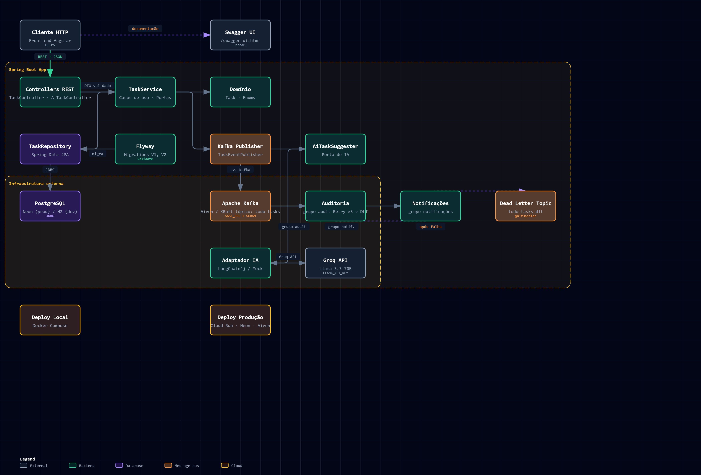

# todoApp — Laboratório Evolutivo de Engenharia de Software e DevOps

O **todoApp** é um laboratório de aprendizado contínuo, estruturado não apenas como uma aplicação de gerenciamento de tarefas, mas como um projeto evolutivo. O objetivo principal é evoluir esta base de código progressivamente ao longo de **11 fases**, simulando o ciclo de vida real de um sistema em produção — partindo da fundação até a alta disponibilidade, observabilidade e escalabilidade horizontal.

Este repositório serve como portfólio técnico e ambiente de experimentação prática de arquitetura de software, DevOps e engenharia de confiabilidade (SRE).

---

## 🚀 O Roadmap das 11 Fases

O projeto evolui adicionando novas camadas de complexidade técnica no mesmo repositório:

1. **Fase 1 — Fundação** (✅ Concluída): API REST funcional desenvolvida em Java 21 e Spring Boot 3.x, persistência relacional com PostgreSQL (local) / H2 (dev), testes unitários, testes de integração com Testcontainers e documentação interativa com Swagger/OpenAPI.
2. **Fase 2 — Containerização** (✅ Concluída): Empacotamento da aplicação com Docker (build multi-stage leve com JRE 21 e usuário não-root) e orquestração do ambiente local (App + Banco) via Docker Compose. Introdução do **Flyway** para controle de versionamento do esquema do banco de dados.
3. **Fase 3 — Mensageria** (✅ Concluída): Introdução de processamento assíncrono orientado a eventos usando Apache Kafka (modo KRaft / Zookeeperless). Implementação de produtores de eventos de tarefas e múltiplos grupos de consumidores (Auditoria e Notificações simuladas), com resiliência baseada em **Dead Letter Topic (DLT)** com retentativas e backoff exponencial.
4. **Fase 4 — Módulo de IA** (✅ Concluída): Assistente de IA com LangChain4j + Groq/Llama 3 para sugerir prioridades, subtarefas e refinar descrições. Fallback automático para MockTaskSuggester quando não há API key.
5. **Fase 5 — Documentação do Vault** (⚠️ Em andamento): Preservação de conhecimento do projeto com regras de negócio, fluxos Kafka, estrutura do banco e guias de dev/deploy no vault Obsidian.
6. **Fase 6 — Deploy em Produção** (✅ Concluída): Aplicação rodando no Google Cloud Run com Neon (PostgreSQL Free) e Aiven Kafka (Free Tier). CI/CD com deploy automático via GitHub Actions.
7. **Fase 7 — CI/CD** (✅ Concluída): Pipeline automatizado de build, teste e deploy via GitHub Actions com polling loop para monitoramento de builds no Cloud Build.
8. **Fase 8 — Observabilidade**: Monitoramento completo com Prometheus e Grafana, tracing distribuído e logs estruturados em formato JSON.
9. **Fase 9 — Infraestrutura como Código (IaC)**: Provisionamento declarativo de recursos em nuvem usando Terraform.
10. **Fase 10 — Redis / Cache**: Otimização de performance com Redis para consultas frequentes e rate limiting.
11. **Fase 11 — Kubernetes**: Implantação escalável da aplicação em Kubernetes (com Minikube ou K3s), definindo manifests, probes de integridade (Liveness/Readiness) e auto-scaling (HPA).

---

## 🛠️ Stack Tecnológica Atual

*   **Java 21 LTS** e **Spring Boot 3.5.x** (Spring Web, Spring Data JPA, Spring Validation, Spring Kafka)
*   **LangChain4j 0.33.x** (Integração com Modelos de IA Generativa via Groq/Llama 3)
*   **GitHub Actions & Google Cloud Run** (Pipeline CI/CD e Deploy Serverless)
*   **PostgreSQL 16** via **Neon** (Banco de dados gerenciado Free Tier)
*   **H2 Database** (Banco de dados em memória para desenvolvimento rápido)
*   **Flyway Database Migrations** (Controle e histórico de esquema de banco de dados)
*   **Apache Kafka** via **Aiven Kafka Free Tier** (Broker de eventos gerenciado, SASL/SCRAM-SHA-256)
*   **Lombok** (Produtividade e redução de boilerplate)
*   **Springdoc OpenAPI 2.8.x (Swagger UI)** (Documentação e teste interativo da API)
*   **JUnit 5 & Mockito** (Testes unitários e mocks de comportamento)
*   **Testcontainers PostgreSQL** (Testes de integração com banco de dados real em containers Docker efêmeros)

---

## 🏛️ Arquitetura do Projeto (Clean Architecture / Ports & Adapters)

### Visão geral do sistema



O diagrama apresenta as integrações HTTP, persistência, mensageria, IA e os ambientes
local e de produção. A versão [interativa](notes/arquitetura-archify.html) e o
[arquivo-fonte](notes/archify-input.json) estão versionados em `notes/`.

O projeto separa as regras de negócio centrais (domínio e casos de uso) dos detalhes de tecnologia (banco de dados, frameworks e mensageria):

```text
src/main/java/com/banzak/todoapp/
│
├── domain/                      # Regras de Negócio Core (Entidades e Enums)
│   ├── Task.java
│   ├── TaskPriority.java
│   └── TaskStatus.java
│
├── application/                 # Casos de Uso e Lógica de Aplicação (Serviços e Portas)
│   ├── TaskService.java
│   ├── TaskEventPublisher.java  # PORTA: Interface para publicar eventos (desacoplada de tecnologia)
│   ├── TaskNotFoundException.java
│   └── ai/
│       └── AiTaskSuggester.java # PORTA: Interface para sugerir subtarefas e refinar prioridade
│
├── infrastructure/              # Detalhes de Tecnologia e Adaptadores (Infraestrutura)
│   ├── persistence/
│   │   └── TaskRepository.java  # Interface Spring Data JPA
│   │
│   ├── messaging/               # ADAPTADORES: Mensageria (Kafka)
│   │   ├── KafkaTaskEventPublisher.java  # Implementação da porta TaskEventPublisher usando KafkaTemplate
│   │   ├── KafkaTaskEventConsumer.java   # Consumidores do Kafka (Auditoria, Notificação e DLT)
│   │   └── TaskEvent.java                # Record DTO para tráfego do evento em JSON
│   │
│   └── ai/                      # ADAPTADORES: IA & LLMs (LangChain4j)
│       ├── AiConfig.java                 # Configuração condicional de beans de IA
│       ├── LangChain4jTaskSuggester.java # Implementação real usando LangChain4j
│       ├── LangChain4jTaskSuggesterService.java # Interface declarativa LangChain4j
│       ├── LangChain4jSuggestion.java    # Record de retorno estruturado
│       └── MockTaskSuggester.java        # Fallback local quando sem chave de API
│
└── interfaces/                  # Camada de Entrada / HTTP REST
    └── rest/
        ├── TaskController.java  # Endpoints REST expostos
        ├── AiTaskController.java # Endpoint REST para o assistente de IA
        ├── GlobalExceptionHandler.java
        ├── config/              # Configurações Web
        │   └── CorsConfig.java  # Configuração de CORS para permitir acesso do Front-End (Angular)
        └── dto/                 # Objetos de Transferência de Dados (Requests/Responses)
```

---

## 🔌 Endpoints da API (REST v1)

Todos os endpoints utilizam o prefixo `/api/v1/tasks`:

| Método | Endpoint | Descrição | Parâmetros de Busca / Filtros |
| :--- | :--- | :--- | :--- |
| `POST` | `/api/v1/tasks` | Cria uma nova tarefa | JSON no corpo da requisição |
| `GET` | `/api/v1/tasks` | Retorna todas as tarefas (sem paginação) | Nenhum |
| `GET` | `/api/v1/tasks/page` | Retorna tarefas com paginação e ordenação | `page`, `size`, `sort`, `status`, `priority` |
| `GET` | `/api/v1/tasks/{id}` | Busca uma tarefa específica por ID | ID na URL |
| `PUT` | `/api/v1/tasks/{id}` | Atualiza os dados de uma tarefa | ID na URL + JSON no corpo |
| `DELETE` | `/api/v1/tasks/{id}` | Remove uma tarefa do banco de dados | ID na URL |
| `POST` | `/api/v1/tasks/ai/suggest` | Sugere prioridade, subtarefas e refina a descrição da tarefa com base no título e descrição originais | JSON no corpo da requisição (title, description) |

---

## 🏃 Como Executar Localmente

### Pré-requisitos
*   Java Development Kit (JDK) 21 instalado localmente (para rodar fora de container).
*   Docker e Docker Compose instalados e configurados.

---

### Modo 1: Orquestração Completa via Docker Compose (Postgres + Kafka + App)
Esta é a forma recomendada, pois ativa todas as integrações reais (Fase 2 e Fase 3).

1.  **Limpar volumes e containers antigos (opcional, para garantir um início limpo):**
    ```bash
    docker compose down -v
    ```
2.  **Compilar o código fonte e iniciar todos os serviços:**
    ```bash
    docker compose up --build
    ```
3.  **Acessar a aplicação:**
    *   **API / Swagger UI:** `http://localhost:8080/swagger-ui.html`
    *   **Banco de Dados PostgreSQL:** Porta `5432` no host local.
    *   **Porta do Broker Kafka (Host Externo):** Porta `29092` no host local (permitindo conexão de ferramentas visuais como Offset Explorer).

---

### Modo 2: Executando apenas os Brokers locais (Banco + Kafka) e o App no Host
Útil para depuração rápida do código Java diretamente na sua IDE.

1.  **Subir apenas o Postgres e o Kafka no Docker:**
    ```bash
    docker compose up -d db kafka
    ```
2.  **Iniciar o Spring Boot local apontando para o profile postgres:**
    ```bash
    ./mvnw spring-boot:run -Dspring-boot.run.profiles=postgres
    ```

---

### Modo 3: Modo de Desenvolvimento Rápido (H2)
Este modo inicia a aplicação usando banco em memória H2. **Nota:** O Kafka Listener auto-startup é desativado por padrão neste profile para evitar erros de conexão na falta do broker.

```bash
./mvnw spring-boot:run
```
*   **Console H2:** `http://localhost:8080/h2-console` (JDBC URL: `jdbc:h2:mem:todoapp`, Username: `sa`)

### Validar health checks localmente

Com a aplicação em execução no modo H2, valide os probes do Actuator em outro terminal:

```bash
curl -i http://localhost:8080/actuator/health/liveness
curl -i http://localhost:8080/actuator/health/readiness
curl -i http://localhost:8080/actuator/health
curl -i http://localhost:8080/actuator/env
```

Os três primeiros endpoints devem responder `200` com `{"status":"UP"}`. O último
deve responder `404`, pois endpoints administrativos não são expostos.

---

## 🚀 Deploy em Produção

A aplicação está disponível em produção com custo zero (Free Tiers):

| Serviço | Provedor | URL / Config |
|---|---|---|
| **API Backend** | Google Cloud Run | `https://todoapp-5h7f6ghm5a-ue.a.run.app` |
| **Banco de Dados** | Neon (PostgreSQL Free) | Gerenciado, SSL obrigatório |
| **Kafka** | Aiven Kafka Free Tier | SCRAM-SHA-256, 5 topics |
| **IA (LLM)** | Groq via OpenAI-compatible API | Llama 3 (gratuito) |

### CI/CD — GitHub Actions

O pipeline executa automaticamente em:

1. **Push para `main`**: Testes → Build Docker → Deploy no Cloud Run
2. **Pull Request para `dev` ou `main`**: Testes (validação)

O build usa `gcloud builds submit --async` com polling loop via `gcloud builds describe` para monitorar o status — evitando problemas de permissão de log streaming.

---

## 🧪 Testando a Resiliência com DLT (Dead Letter Topic)

Os consumidores Kafka do projeto estão configurados com uma política de retentativas. Se um erro ocorrer ao ler uma mensagem:
1. O Spring Kafka tenta re-processar a mensagem **3 vezes**, aplicando um **Backoff Exponencial** (com atraso progressivo dobrado a cada tentativa).
2. Se a falha persistir após as 3 tentativas, a mensagem é encaminhada para o tópico de descarte `todo-tasks-dlt`, onde o manipulador `@DltHandler` registra a falha.

### Como simular e validar o fluxo de DLT:
1. Com a aplicação rodando no Docker Compose, faça um envio `POST` para criar uma tarefa.
2. No **título** da tarefa, inclua a palavra **`fail`** ou **`falha`** (ex: `{"title": "Testar DLT fail", "priority": "HIGH"}`).
3. Acompanhe os logs no seu console do Docker. Você verá o consumidor de auditoria tentando processar a mensagem, falhando, aplicando o backoff e, após a 3ª tentativa, encaminhando-a para o DLT com sucesso.

---

## 🧪 Rodando os Testes Automatizados

A suíte de testes conta com testes unitários, testes de integração reais (usando Docker/Testcontainers para PostgreSQL real) e testes de contrato HTTP (MockMvc).

Execute todos os testes com o comando:
```bash
./mvnw clean test
```

---

## 🧑‍💻 Desenvolvedor
*   **Leonardo Santana** (Pleno)
*   LinkedIn: [linkedin.com/in/banzak](https://linkedin.com/in/banzak)
*   GitHub: [github.com/banzak1](https://github.com/banzak1)
